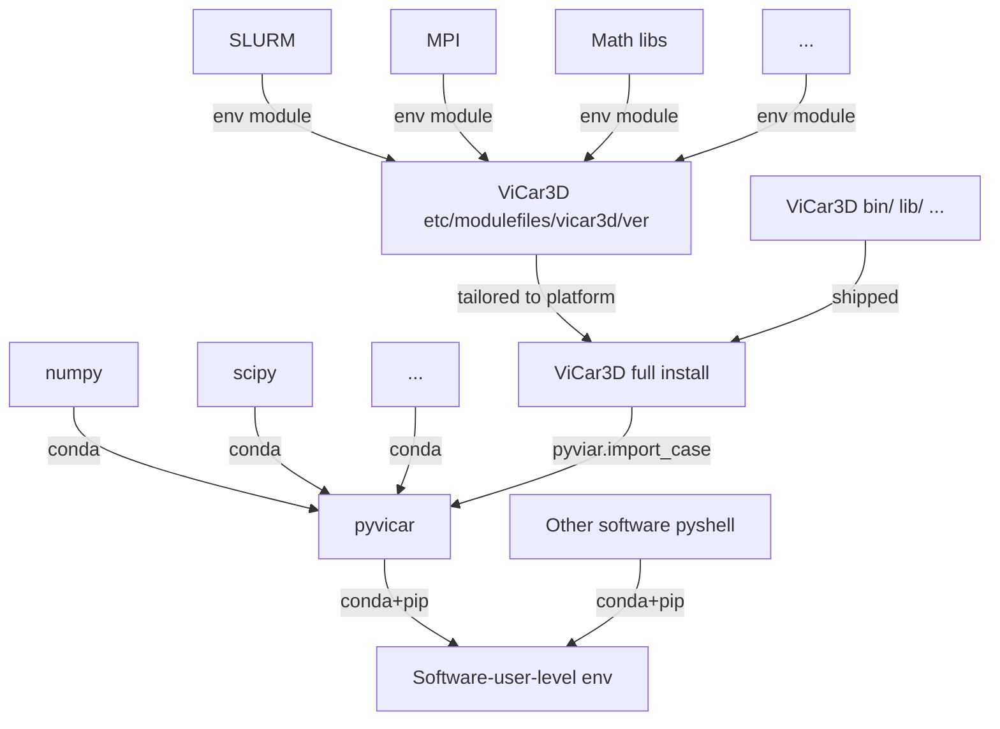

# pyvicar
Python shell for in-house Vicar3D Immersed Boundary Method CFD Solver. 
It enables seamless connections between numpy dataset and input/output files, 
programmable batch generation and postprocessing,
and provides tools to generate grids and surface mesh.

## Dependencies

pyvicar is a wrapper to connect ViCar3D distribution backend into python environment,
so the backend needs to be installed following its manual first.
It is recommended to isolate its runtime env only in the job file
and leave login shell managed by conda as a software user.

The runtime env settings are defined during ViCar3D installation as a module config file,
which will be loaded in the job file generated by pyvicar.
Users when running ViCar3D thru pyvicar do not need to take care of the runtime env and 
only need to deal with pyvicar as a python package and import an installed ViCar3D distribution.
The generated job script will look like the following to create an isolated clean runtime env for ViCar3D,
and the responsibility of user-level python stops at sending this job file to bash or slurm:
<pre>
#!/bin/bash
#SBATCH --job-name='casename'
#SBATCH --partition=partition
#SBATCH --time=2-00:00:00
#SBATCH --nodes=1
#SBATCH --ntasks-per-node=48
#SBATCH --account=account
#SBATCH --output=log.out
#SBATCH --error=log.err

# Here starts script
source "$(conda info --base)/etc/profile.d/conda.sh"
while [[ -n "$CONDA_SHLVL" && "$CONDA_SHLVL" -gt 0 ]]; do
    conda deactivate
done
module purge
module use .../ViCar3D/versions/ver/etc/modulefiles
module load vicar3d/ver

mpirun -np 48 .../ViCar3D/versions/ver/bin/ViCar3D 
</pre>
where etc/modulefiles/vicar3d/ver is the module file mentioned above, which should be configured 
either manually when installing the shipped binary distribution 
or thru provided CMake arguments when compiling from source code.
The etc/modulefiles/vicar3d/ver config and these env management blocks in the job file
are optional currently thru all v1.0.x for backward compatibility,
so one can ignore these options when configuring job object in pyvicar (default off)
and manage runtime env manually outside the script like in v1.0.0,
but will become mandatory and the default style of management starting from v1.1.0.
Detailed usages and options can be found in the examples.

After ViCar3D is correctly installed on a platform, pyvicar requires the following python package.

- python>=3.8,<3.13
- numpy (dataset data structure)
- scipy (postprocessing tools)
- numpy-stl (reading .stl geometries)
- trimesh (operating triangular meshes)
- pandas (reading output tables)
- h5py (storing database, can be auto handled by conda)
- matplotlib (visualize dataset)
- mpi4py (parallel postprocessing)
- ffmpeg (convert frames to video files, can be auto handled by conda)
- ffmpeg-python (python controller of above)

These are managed by conda so simply:
<pre>
conda create -n vicar python=3.12
conda activate vicar
conda install -c conda-forge    \
    numpy scipy numpy-stl       \
    trimesh pandas h5py matplotlib
conda install -c conda-forge mpi4py vtk=*=osmesa*
conda install -c conda-forge ffmpeg-python pyvista
</pre>
It is separated into multiple commands in case of slow env solving process,
and keep the sequence of matplotlib-vtk-ffmpeg/pyvista in case of vtk build overwrite.

VTK can use X server, off-screen CPU, or off-screen GPU.
Typically one need to install osmesa (off screen mesa) build on cluster 
otherwise it will be stuck in endless wait for an X server that does not even exists.
When postprocessing is taking too much time while 
still generating nothing, it might be waiting in such a situation. 
egl is not tested so we specified the osmesa build above.
Other options are
<pre>
conda install -c conda-forge vtk           # normal with x server
conda install -c conda-forge vtk=*=osmesa* # headless cpu
conda install -c conda-forge vtk=*=egl*    # headless gpu
</pre>
Check the type using either conda list or:
<pre>
python -c "import vtk; rw = vtk.vtkRenderWindow(); print(rw.GetClassName())"
</pre>
Especially on cluster or X display server is not available, 
make sure this shows an OS (Off Screen) type.

If one wants to share existing mpi library,
like sending platform-specific cross-node pyvicar parallel postprocessing,
make sure the mpi4py wrapper links against the platform mpi correctly:
<pre>
which mpicc
pip install --no-binary mpi4py --no-cache-dir --force-reinstall mpi4py
python -c "from mpi4py import MPI; print(MPI.Get_library_version())"
</pre>
and this platform mpi will need to be visible at user level together with conda
since it becomes the conda package backend.

## Install
Once the dependencies are handled, installing pyvicar is simply a pip install:
<pre>
git clone https://github.com/XianlinSheng/pyvicar.git
cd pyvicar
git checkout v1.0.1 # or other release tag
pip install .
</pre>
Now one can copy the examples/01_geometry/01_sphere.py to a test folder
and run it after changing the pyvicar.import_case(...) line to the path where ViCar3D backend is installed.

## Examples

Foundamentally, configuration is set in the style of:
<pre>
from pyvicar.case import Case

c = Case('case_folder_path')

c.input.parallel.npx = 4
c.input.parallel.npy = 4

c.input.domain.xout = 10
c.input.domain.yout = 5
c.input.domain.zout = 5

c.input.domain.nx = 129
c.input.domain.ny = 65
c.input.domain.nz = 65

c.input.bc.x1.bcx1 = 'dirichlet'
c.input.bc.x1.ux1 = 1.0

c.write()
</pre>
Default values will apply if not specified,
check the generated files to see the defaults.

To setup custom grid:
<pre>
from pyvicar.case import Case
from pyvicar.grid import Segment

middle = Segment.uniform_dx(start=1, end=2, dx=0.01)
left = Segment.grow_toward_left(rterminal=middle, lend=0, growthrate=1.05)
right = Segment.grow_toward_right(lterminal=middle, rend=3, growthrate=1.05)
xaxis = left + middle + right

c = Case('case_folder_path')

c.xgrid.enable()
c.xgrid.nodes = xaxis

c.write()
</pre>

These basic operations are equivalent of setting input files but programmable.
When starting to set multiple bodies, cases, and optimize grid refinements and generations,
these might seem too low-level, so in fact pyvicar already wraps up 
some frequently-used operations into tool functions
and can accomplish a human-level command by one function call.

For example, the following short script 
can setup a flow past sphere at given resolution
in 10 lines of code, with a sphere mesh being made, 
a suitable and locally refined grid being generated,
multiple coupled body element and placement entries being handled,
several lines of BC type and values being compressed,
and physical parameters being transformed.
<pre>
from pyvicar.case import Case

d = 1
U = 1
re = 200
dx = d / 20

c = Case("case_folder_path")
gm = c.create_grid(l0=d, dx=dx)
body, surf = c.append_sphere(d / 2, dx, gm.center)
c.set_inlet("x1", [U, 0, 0])
c.set_re(re, U=U, L=d)

c.write()
</pre>

ViCar3D has multiple versions for different or special uses,
and pyvicar provides the ability to use them in the same API
for common jobs.
Even for unique features it will still keep a 
consistent style of using and help query.
A standard ViCar3D distribution contains a 
bin/ for executables, and a lib/ for internal dependencies 
and pyvicar_addons support.
In the above few examples we were using the minimal common
built-in config formats and entry options, 
and to work on a specific distribution,
simply change how to import the Case class:
<pre>
import pyvicar

Case = pyvicar.import_case("your/path/to/distribution")

d = 1
U = 1
re = 200
dx = d / 20

c = Case("case_folder_path")
gm = c.create_grid(l0=d, dx=dx)
body, surf = c.append_sphere(d / 2, dx, gm.center)
c.set_inlet("x1", [U, 0, 0])
c.set_re(re, U=U, L=d)

c.write()
</pre>
The distribution path is the root folder that sees root/bin, root/lib.
Sanity and version check will be done during importing,
and it will throw exceptions if the installation
is not complete, the support is corrupted, 
or the support relies on features too old or too new in this pyvicar framework.
Different distributions may vary in the available options 
of the entries, may provide additional models or features, 
and tool functions too.
However, note that one can ONLY use either built-in default layout
or an imported distribution during the runtime of entire python program.
Dynamic switch is allowed as long as the program is based on only one.
Furthermore, since the built-in Case is not linked to any distributed binaries,
it cannot be run using:
<pre>
from pyvicar.case import Case
c = Case("case_folder_path")
# these wont work saying there is no attribute runpath
# c.mpirun()
# c.job.enable()
# c.sbatch() does not need runpath but it needs job to be generated
</pre>

Further examples are located in the examples folder 
covering how to generate 2D/3D bodies, make common postprocessings, 
and to manage a complete project with multiple simulations 
and batched postprocessings.
These examples shown in this pyvicar main framework are considered
common jobs and are supported in all distributions.
Examples of unique features will be bundled with the 
pyvicar_addons in a specific ViCar3D version.

